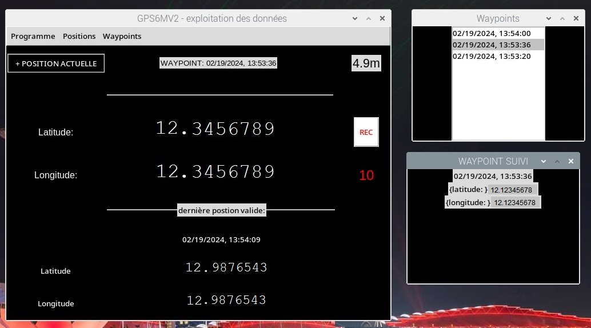

# Pi-GPS
+ Using Tkinter (Python windows system) - GPS6MV2 module
+ 

# SCREENSHOT

-- python3 gps_tkinter.py

# COMMENTS FROM THE CREATOR

- first execute gps_raw.py to test your setup. It will display in terminal latitude/longitude received live from your GPS module.
- if gps_raw.py does not display any value after a 'certain amount of time'... check yoursetup
- execute gps_tkinter.py
- main window + waypoints-list window will open
- it will load the file gps_tkinter.json, which contains the last valid GPS position received (if ever)
- the last valid GPS position is displayed on bottom
- as soon as the GPS module receives a valid position, it will overwrite the gps_tkinter.json value
- I made it this way to write down the last valid position, whatever can occurs after it will be saved in a file not in a volatile memory
- program loop: display last valid position / if new position received, write as the last valid position / display in the program window center the value read - XXX for unreadable and invalid values

# FUNCTIONS
- DISPLAY LIVE GPS position
- RECORD history all GPS positions received in a .json file [date,latitude,longitude]
- WAYPOINTS list .json to choose from
- DISPLAY DISTANCE to chosen waypoint
- SET actual GPS position as a waypoint (named by date)
- CLEAR GPS positions history .json

# MENU

# WAYPOINTS
In this concept Waypoints are collected from the file "gps_tkinter_waypoints.json"
This file is easily editable if needed.
Version 0-1:
  - add actual GPS position as a waypoint in the file "gps_tkinter_waypoints.json" with button "+ POSITION ACTUELLE" top left corner

# WAYPOINTS LIST
The list displays waypoints written in "gps_tkinter_waypoints.json" by names.
When a waypoint name is selected from the list window,
a new window will open, to display name, latitude and longitude.
Selecting a waypoint will turn the distance displaying on top right corner of the main program window.
The chosen waypoint is written in file "gps_tkinter_waypoint.json".

# POSITIONS
Button REC to start recording.
The button will turn on Red when activ.
A counter displays the count of all GPS positions written in the file "gps_tkinter_datas.json".

## LANGAGE
- made in French :)

## TO-DO
- on clear waypoints list: reload list
- on add new waypoint: reload list
- add waypoint window to finish
- add russian
- add english
- blank actual targeted waypoint
